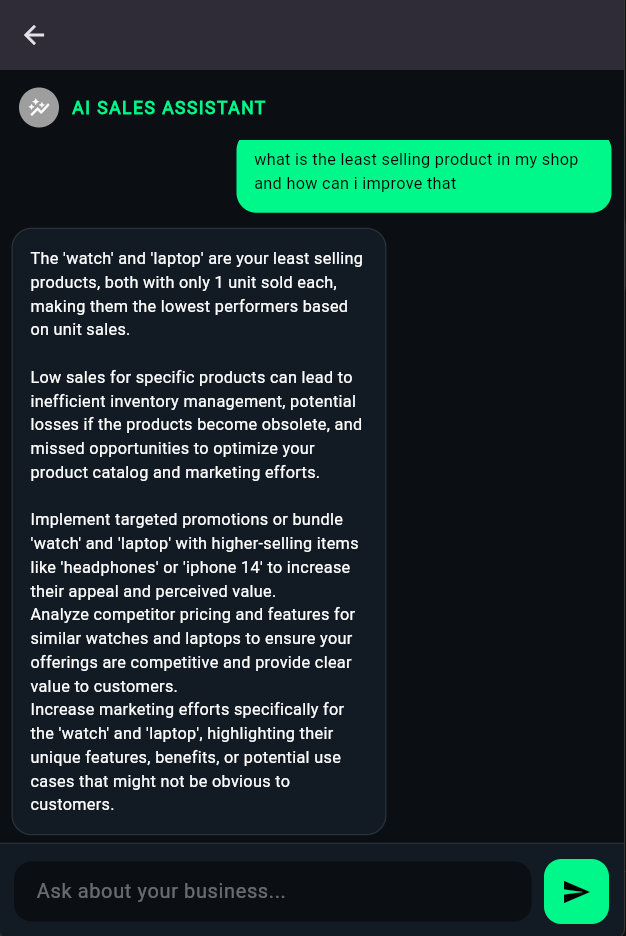
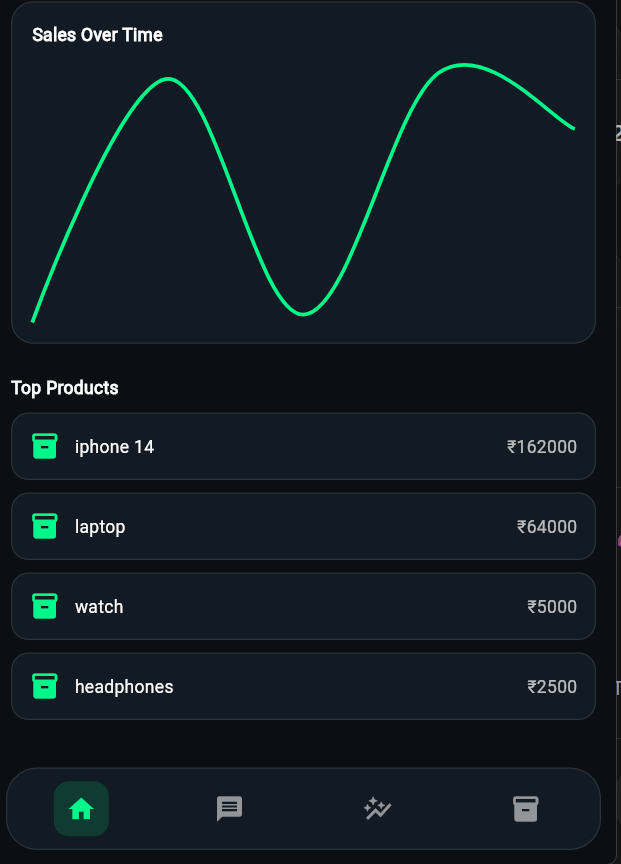
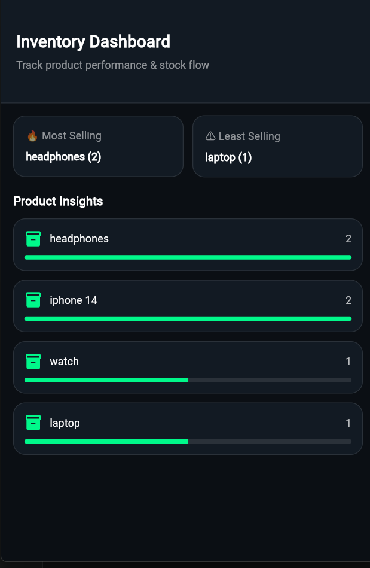

# FinClick – Smart Sales Analytics for SMEs

FinClick is a sales analytics app for small and medium businesses to track sales, understand customers, and make better decisions using data and AI.

---

## Preview

---

## Features

- Real-time sales tracking  
- Revenue and performance insights  
- AI-based recommendations  
- Inventory management  
- Customer re-engagement  
- CSV upload with automatic cleaning  

---

## Problem

Small businesses struggle to track sales and understand customer behavior. Existing tools are complex or expensive.

---

## Solution

FinClick allows users to upload sales data, automatically process it, and view insights in a simple dashboard with AI assistance.

---

## USP

- Simple and easy to use  
- Combines analytics and AI  
- Works with raw CSV data  
- Built for non-technical users  

---

## Process Flow

CSV Upload -> Data Cleaning (FastAPI) -> Storage (Supabase) -> Analytics -> Dashboard -> AI Insights

---

## Architecture

Flutter App -> Supabase -> FastAPI -> AI Layer

---

## Tech Stack

- Flutter  
- FastAPI (Python)  
- Supabase (PostgreSQL)  
- Gemini API  

---

## Setup

Clone the repo:

git clone https://github.com/yourusername/finclick.git  
cd finclick  

Run frontend:

flutter pub get  
flutter run  

Run backend:

pip install -r requirements.txt  
uvicorn main:app --reload  

---

## Environment Variables

Create a .env file:

SUPABASE_URL=your_url  
SUPABASE_ANON_KEY=your_key  
GEMINI_API_KEY=your_key  

---

## Future Work

- WhatsApp integration  
- Predictive analytics  
- Multi-user support  
